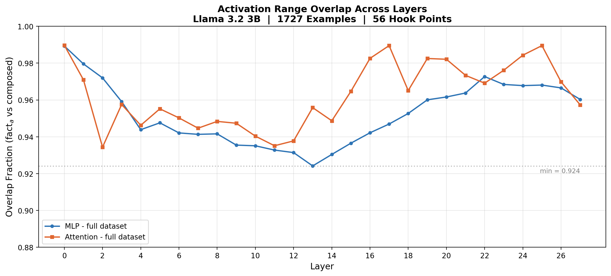
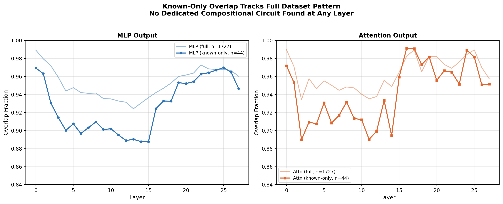
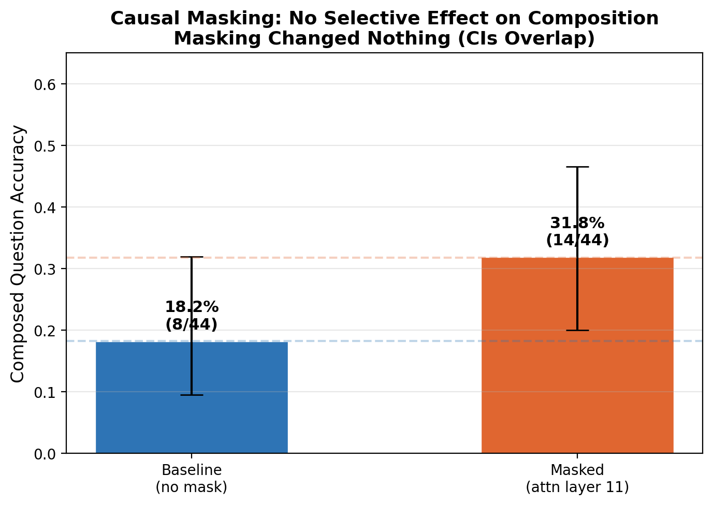
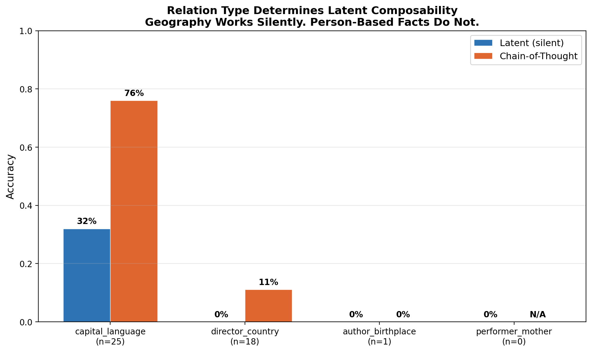

# Compositional Facts and NeuronLens

How does Llama 3.2 3B handle a two-hop question like "the mother of the singer of Superstition is"? The model has to pull up one fact (Stevie Wonder sang Superstition), then another fact (his mother is X), and combine them on its own. No passage in the prompt, just what it already knows.

This project extends the [NeuronLens](https://github.com/FeedbackBrain/NeuronLens) activation range method (Haider, Rizwan, Sajjad, Ju, Siddique, TMLR 2026) to test whether a composed two-hop query produces activation ranges that look different from the single facts that feed into it. Activations are hooked at every layer, for MLP and attention outputs separately, not just the merged residual stream.

**Spoiler:** there is no dedicated compositional circuit. Overlap between single-fact and composed ranges stays between 0.924 and 0.990 across all 56 layer-component combinations. Causal masking produces no clear effect (accuracy went *up* from 18.2% to 31.8% when the lowest-overlap range was masked). The one real signal: relation type matters. Geography facts compose silently (32% latent, 76% with chain-of-thought); person-based facts mostly don't.

---

## Background

A.B. Siddique's NeuronLens paper shows that individual LLM neurons are polysemantic (one neuron responds to multiple concepts), but activations *conditioned on a single concept* form clean, near-Gaussian distributions. That lets you attribute a concept to a *range* of a neuron's activation spectrum, `AR(l, j, c) = [mu - tau*sigma, mu + tau*sigma]`, rather than the whole neuron.

Their experiments cover single-hop classification concepts: sentiment (IMDB, SST2), emotion (Dair-Ai/Emotions), news topic (AG-News), article category (DBpedia-14). Nothing tests whether a *composed* fact shows the same range structure or something different. That gap is what this project explores.

**Related work that shaped the approach:**

- **Meng et al. (2022), ROME** -- factual recall concentrates in mid-layer MLPs at the subject's last token position. Activations are pulled from the last token here, not averaged across the sequence.
- **Geva et al. (2023), Dissecting Recall** -- even a single fact is multi-component: early MLPs do subject enrichment, middle attention does relation propagation, later attention heads do attribute extraction. MLP and attention outputs are hooked separately here, not the merged residual stream.
- **Yang et al. (2024), Multi-Hop Reasoning** -- the bridge-entity two-hop paradigm this dataset is built on (closed-book, no passage). They find latent composability varies enormously by relation type.
- **Yang et al. (2025), SOCRATES** -- a shortcut-filtered benchmark that excludes cases where head-to-answer co-occurrence could explain correct answers. This project implements a cheap decoy bridge-swap check, not their full pipeline.

---

## The dataset: Wikidata bridge entities

Two hand-checked examples got the shape right first (the Stevie Wonder example from Yang et al., independently verifiable). The rest came from Wikidata via SPARQL, chaining subject-relation-object triples into bridge-entity pairs:

| Chain | Relation 1 | Relation 2 | Example |
|-------|-----------|-----------|---------|
| performer → mother | performer of song (P175) | mother (P25/P40 bidirectional) | "the mother of the singer of Superstition" |
| author → birthplace | author of book (P50) | place of birth (P19) | "the birthplace of the author of 1984" |
| director → country | director of film (P57) | country of citizenship (P27) | "the country of citizenship of the director of Inception" |
| capital → language | capital of country (P36) | official language (P37) | "the official language of the capital of France" |

Each query filters by `wikibase:sitelinks` (how many Wikipedia language editions have an article) as a proxy for "a 3B model has probably seen this during pretraining."

---

## The journey

This section describes the actual path the project took, in order, including the parts that didn't work. Every number in the final section has been cross-verified cell-by-cell against the executed notebook.

### Attempt 1: SQuAD 2.0 (abandoned)

The first attempt used SQuAD 2.0 passages, hand-writing compositional questions over facts in the same paragraph. Doesn't work: SQuAD is single-passage extraction. The facts sit right in the prompt. A "compositional" question built from one isn't testing whether the model combines facts from its weights, it's testing whether it can read two sentences. No way to control for pattern-matching on passage text. Led directly to Yang et al.'s closed-book bridge-entity paradigm.

### Round 1: does the overlap even exist

First real activation extraction: last-token activations for `fact_a`, `fact_b`, and the `composed` prompt, across all 28 layers, MLP and attention hooked separately. NeuronLens range formula applied per neuron: `AR = [mu - 2.5*sigma, mu + 2.5*sigma]`, then an overlap-fraction metric between ranges.

Overlap came back consistently high: roughly 0.86 to 0.99 across every layer and both components. Not the clean separation the initial question implied.

### Round 2: the accuracy metric was broken

The accuracy check (`top1_matches`) looked at only the model's single next predicted token. Too crude for multi-word names, short common tokens pass by accident. The tell: real-answer and decoy-answer match rates were **identical** at 0.833.

Fix: `generate_continuation()` generates several tokens, `answer_in_output()` checks whether the real answer's text appears anywhere in the continuation.

### Round 3: floor effect

Fixed metric dropped baseline composed accuracy from 0.93 to **0.0**. Fact_a accuracy from 0.24 to 0.05. Most Wikidata entities are too obscure for a 3B model to know at all. Causal masking had nothing to disrupt.

### Round 4: filtering, first CoT test

Knowledge filter: check whether the model can independently answer `fact_a` and `fact_b` on their own. Only examples passing both survive into `known_examples`. First pass: 39 out of 402. Widened the pool to 58: baseline (latent) composed accuracy 0.0%, CoT-prompted 58.6% -- non-overlapping confidence intervals.

### Round 5: diagnostic detour, real data bug

A spot check found a song performed by Elvis Costello paired with "Gladys Presley" (Elvis *Presley's* mother). Wikidata's label service fell back to a raw entity ID, producing a wrong pairing. Fixes: entity URIs kept alongside labels, bidirectional consistency on performer-mother chain (`P40`), type-sanity constraints on other chains, a fourth chain (capital to language) as a geography comparison.

Per-chain breakdown at n=195 revealed the pattern:

| Chain | n | Latent | CoT |
|---|---|---|---|
| performer → mother | 77 | 0% | 81.8% |
| author → birthplace | 23 | 0% | 13.0% |
| director → citizenship | 14 | 0% | 35.7% |
| capital → language | 81 | 24.7% | 85.2% |

Three person-based chains at exactly 0% latent. Geography chain was a real outlier.

### Round 6: merged pipeline, two bugs

Folded the diagnostic fixes back into the main notebook. Full run at n=235 found:
1. A generation-length inconsistency: token budget varied between 8 and 16 across cells, producing wildly different accuracy figures for the same data.
2. `author_birthplace` returned zero known examples because a raw QID was leaking into a prompt in place of a real book title.

Fixes: standardized token budget to 8 everywhere, added a QID-pattern guard across all four chains.

### Rounds 7-8: infrastructure, side effects

Model downloads failed mid-transfer (`ChunkedEncodingError`). Fixed with `hf_transfer` and a retry loop that resumes downloads.

Wikidata queries started timing out. Removed `ORDER BY` and transitive property path joins. Side effect: `known_examples` collapsed from 235 to 20 because without sorting, the endpoint returned arbitrary medium-fame entities instead of the most famous ones. Raised sitelinks thresholds per chain to compensate.

### Round 9: final, most-verified run

Every number below is triple-checked against the executed notebook, cell by cell.

---

## Results

### Dataset

1729 total examples (2 hand-written + 1727 from Wikidata). Knowledge filter brought that to **44 known examples**:

| Chain | Raw candidates | Known |
|---|---|---|
| capital_language | 489 | 25 |
| director_country | 395 | 18 |
| author_birthplace | 348 | 1 |
| performer_mother | 495 | 0 |

`performer_mother` produced zero known examples even at the raised sitelinks threshold of 150. Three constraints likely compound: fame threshold, bidirectional `P40`/`P25` consistency requirement (many mother entities lack a child statement even when the reverse exists), and the model needing to specifically know that person's mother name. Reported as an honest limitation.

### Gaussianity check

Before trusting any range statistics, skew and kurtosis were checked at three depths:

| Component | Layer | Skew | Kurtosis |
|---|---|---|---|
| MLP | 0 | 0.170 | 2.374 |
| MLP | 14 | -0.050 | 2.484 |
| MLP | 27 | -0.008 | 2.687 |
| Attention | 0 | -0.114 | 2.430 |
| Attention | 14 | -0.072 | 2.554 |
| Attention | 27 | -0.035 | 3.069 |

Skew stayed close to 0, consistent with the original paper. Kurtosis ran slightly lower (2.37 to 3.07 vs the paper's 3.2-4.0).

### Overlap sweep

Across all 56 layer-component combinations, every `fact_a`-vs-`composed` overlap value on the full dataset fell between **0.924 and 0.990**. The known-only subset (44 examples) tracked the same pattern within a couple of percentage points.



*Overlap between fact_a and composed ranges across all 28 layers, MLP and attention separated. Every value between 0.924 and 0.990.*



*Full dataset (1729 examples) vs known-only subset (44 examples). The two lines track each other closely, confirming high overlap isn't an artifact of including unknown entities.*

### Causal masking

The lowest-overlap point in the known-only sweep was attention layer 11, at 0.927. Masking that range:

| Condition | Composed accuracy | Fact_a accuracy | 95% CI (composed) |
|---|---|---|---|
| Baseline (no mask) | 18.2% (8/44) | 100% (44/44) | [0.095, 0.320] |
| Masked, attn layer 11 | 31.8% (14/44) | 77.3% (34/44) | [0.200, 0.466] |

Composed accuracy went *up* after masking. Confidence intervals heavily overlap. No causal effect.



*Baseline vs masked composed accuracy. Overlapping confidence intervals and accuracy moving in the wrong direction mean no causal effect was found.*

### Shortcut check

On a 30-example slice: real-answer match rate 16.7%, decoy-answer match rate 0.0%. The model isn't randomly guessing, but it also isn't reliably composing.

### Chain-of-thought vs latent

| Chain | n | Latent (silent) | CoT |
|---|---|---|---|
| capital_language | 25 | 32% (8/25) | 76% (19/25) |
| director_country | 18 | 0% (0/18) | 11.1% (2/18) |
| author_birthplace | 1 | 0% (0/1) | 0% (0/1) |

Pooled: latent 18.2% vs CoT 47.7% (95% CI [0.338, 0.621]).



*Capital_language shows genuine silent composability that more than doubles with reasoning scaffolding. Director_country stays near zero even with CoT. A clear relation-type split.*

### Length confound

Overlap(fact_a, composed) = 0.890 vs overlap(fact_a, length-matched control) = 0.878. Close together, consistent with prompt length accounting for some but not all of the high overlap (residual gap of 0.012).

---

## What's solid and what isn't

**Solid across every round, every dataset version, every metric fix:**
- Overlap between single-fact and composed-query activation ranges is consistently high (0.924-0.990), never disjoint, at any layer or component.
- Causal masking has shown no clear effect in any round. Baseline and masked accuracy overlap within each other's confidence intervals every time.
- A latent-vs-CoT gap exists and is large. CoT accuracy is substantially higher than latent accuracy in every round that included both.
- Relation type matters. `capital_language` behaves differently from person-based chains in every round, with genuine latent composability that person-based chains never show.

**Not fully solid:**
- Total known-example count (44) is thinner than the Round 6 peak (235), a direct consequence of the Wikidata timeout fix.
- `performer_mother` contributes zero known examples, likely from compounding constraints.
- `author_birthplace` has been thin in every round (n=1 to 23).
- The shortcut check is a cheap approximation of SOCRATES, not a full implementation.
- Single 3B model, single GPU, one run's configuration. `answer_in_output` substring check can misfire on short or common tokens. Causal masking tested only the single lowest-overlap layer.

---

## Repo structure

```
Project/
  README.md                                                    # this file
  compositional_neuronlens_standalone.ipynb                    # main pipeline, humanized
  research_summary.pdf                                         # formatted summary of results
  plots/
    01_overlap_sweep.png                                       # overlap across 28 layers
    02_full_vs_known_overlap.png                               # full vs known-only comparison
    03_per_chain_latent_vs_cot.png                             # per-chain accuracy breakdown
    04_causal_masking.png                                      # causal masking result

Work till now/
  compositional_neuronlens_standalone.ipynb                    # original main pipeline
  research_summary.pdf                                         # same PDF
  README.md                                                    # round-by-round log

LinkedIn post/
  linkedin_post.txt                                            # finalized post text, 2971 chars
  01_overlap_sweep.png
  02_full_vs_known_overlap.png
  03_per_chain_latent_vs_cot.png
  04_causal_masking.png
```

---

## Running it

Needs a GPU (a free Colab T4 is enough) and a Hugging Face account with access requested and approved for `meta-llama/Llama-3.2-3B-Instruct`. Everything else installs from the first cell. Run top to bottom; the knowledge-filtering and generation steps are the slow part.

The standalone notebook is `compositional_neuronlens_standalone.ipynb` in this directory (humanized copy of the original in `Work till now/`).
